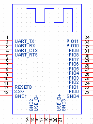

CCLoader
========

Burn CC254x firmware using an Arduino board.

1. Load the CCLoader Arduino sketch to the UNO board.
2. Wire the pins:
  
3. Use CCLoader.exe to load the Demo.bin to the UNO board and the board will burn the firmware to the BLE Mini.

### Wiring Diagram

    | Name | | CC2541 | | Arduino |
    | - | - | - |
    | DEBUG_CLOCK | | Pin 7 | | Pin 5 |
    | DEBUG_DATA | | Pin 8 | | Pin 6 |
    | RESET_N | | Pin 11 | | Pin 4 |
